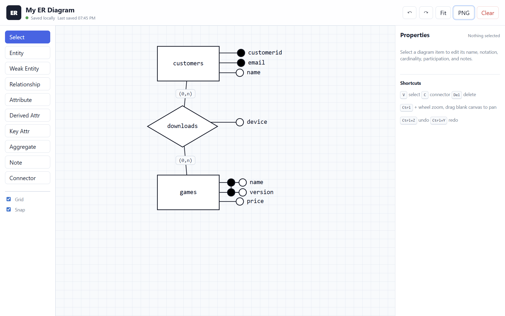
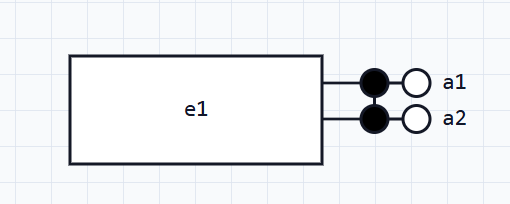
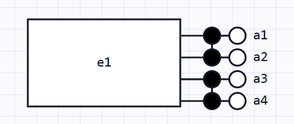
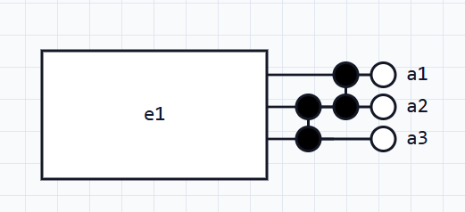
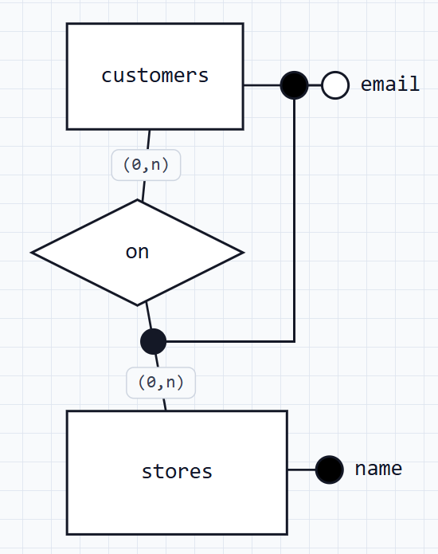

# ERD Diagram Drawer



A lightweight browser-based ERD editor for [CS2102](https://nusmods.com/courses/cs2102)-style entity-relationship diagrams. It uses SVG for crisp shapes and local browser storage for persistence.

## Basic Features
- Create and edit entities, attributes, and relationships.
- Support for composite keys and overlapping composite keys.
- Support for weak entities and identifying relationships.
- Support for aggregations.
- Persistence across browser sessions and automatic recovery.
- Export to PNG.

## Advanced Features

### Composite Keys


1. Create an entity and add some key attributes.
2. Select the key attributes and tick `Composite attribute marker` on the right sidebar.
3. Use the `Composite group(s)` field on the right sidebar to specify which group the key attribute belongs to. For example, if you want to create a composite key with three attributes, you can assign them to the same `group id`, for example, `1`.
4. Repeat steps 2-3 for other key attributes that should be part of the same composite key. Note that these attributes should share the same `group id`.

**Notes**:


- Multiple composite keys can be created by assigning different `group ids` to different composite attributes. 


- Overlapping composite keys can be created by assigning multiple `group ids` to the `Composite group(s)` field using a comma separated list. For example, `1,2`.

### Partial Keys



1. Create a Weak Entity
2. Add a key attribute to the Weak Entity and tick `Partial key / weak marker` on the right sidebar.
3. Add another entity (entity that the weak entity is related to).
4. Add a relationship connecting the weak entity and the other entity. 
5. Select the relationship and tick `Identifying (dot markers)` on the right sidebar.

## Run

```powershell
node server.js
```

Then open:

```text
http://localhost:4173
```

## Persistence

The app auto-saves every meaningful change to `localStorage` using a versioned project JSON schema. 

Reloading the page restores the last diagram in the same browser.
